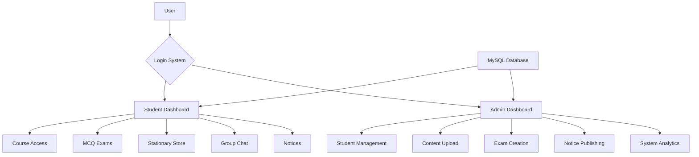

# 📚 StudyBuddy – Smart Campus LMS Portal

<div align="center">


<br>

**A Complete Web-Based Learning Management System for Educational Institutions**

*Streamlining campus operations with smart digital solutions*

[Installation](#-installation--setup) • [Features](#-features) • [Demo](#-demo) • [Documentation](#-documentation)

</div>

## 🌟 Overview

**StudyBuddy** is a comprehensive Learning Management System designed to transform traditional campus operations into a seamless digital experience. This web-based portal serves both students and administrators with role-specific dashboards, academic tools, and campus utilities—all integrated into one powerful platform.

### 🎯 Key Highlights
- **Dual Dashboard System**: Separate interfaces for students and admins
- **Complete Academic Suite**: Courses, exams, notices, and materials
- **Campus E-commerce**: Integrated stationary store
- **Real-time Communication**: Group chat and notice board
- **Modern UI/UX**: Video backgrounds and responsive design

<h3>VS Code Workspace</h3>

<p align="center">
  
</p>

<p align="center">
  
</p>

<p align="center">
  
</p>


## 🏗️ System Architecture

<div align="center">



</div>

## 🚀 Features

### 🎓 For Students
| Feature | Description | Status |
|---------|-------------|---------|
| 📚 Course Access | Browse and access course materials | ✅ Implemented |
| 🎯 MCQ Exams | Take automated tests with instant scoring | ✅ Implemented |
| 🛒 Stationary Store | Purchase study materials online | ✅ Implemented |
| 💬 Group Chat | Real-time communication with peers | ✅ Implemented |
| 📢 Notice Board | View important announcements | ✅ Implemented |
| 👤 Profile Management | Update personal information | ✅ Implemented |

### ⚙️ For Administrators
| Feature | Description | Status |
|---------|-------------|---------|
| 👥 Student Management | Add, edit, and manage student accounts | ✅ Implemented |
| 📁 Content Management | Upload and organize course materials | ✅ Implemented |
| 🎯 Exam Creation | Create and manage MCQ examinations | ✅ Implemented |
| 📢 Notice System | Publish campus announcements | ✅ Implemented |
| 📊 System Analytics | Monitor platform usage and performance | ✅ Implemented |

## 🛠️ Technology Stack

### Frontend Layer
- **HTML5** - Semantic markup and structure
- **CSS3** - Modern styling with Flexbox/Grid
- **JavaScript** - Interactive functionality
- **Responsive Design** - Mobile-first approach

### Backend Layer
- **PHP** - Server-side logic and processing
- **MySQL** - Relational database management
- **Apache** - Web server environment

### Development Tools
- **XAMPP** - Local development environment
- **phpMyAdmin** - Database management
- **VS Code** - Code editor

## 📥 Installation & Setup

### Prerequisites
- XAMPP/WAMP Server (Apache + PHP + MySQL)
- Modern web browser (Chrome, Firefox, Edge)
- PHP 7.4 or higher
- MySQL 5.7 or higher

### Quick Start Guide

#### Step 1: Environment Setup
```bash
# Download and install XAMPP
https://www.apachefriends.org/

# Start Apache and MySQL services
# Via XAMPP Control Panel
```

#### Step 2: Project Deployment
```bash
# Extract project files to:
C:\xampp\htdocs\StudyBuddy\

# Or clone from repository
git clone <repository-url>
cp -r StudyBuddy/ C:/xampp/htdocs/
```

#### Step 3: Database Configuration
```sql
-- Access phpMyAdmin at:
http://localhost/phpmyadmin

-- Create new database 'studybuddy'
-- Import SQL file:
Database/init.sql
```

#### Step 4: Launch Application
```
Open your browser and navigate to:
http://localhost/StudyBuddy/
```

### Default Accounts
| Role | Username | Password | Access Level |
|------|----------|----------|--------------|
| Student | User-registered | User-defined | Course access, exams, store |
| Admin | Pre-configured | Pre-configured | Full system control |

## 📁 Project Structure

```
StudyBuddy/
├── 📂 student_dashboard/
│   ├── student_dashboard.html    # Main student interface
│   ├── courseview.html          # Course materials viewer
│   ├── stationary.html          # E-commerce section
│   ├── chat.html               # Group chat interface
│   └── exam.html              # MCQ examination portal
│
├── 📂 admin_dashboard/
│   ├── admin_dashboard.html     # Administrative control panel
│   ├── upload_content.html     # Course content management
│   ├── manage_students.html    # Student account management
│   ├── add_exam.html          # Exam creation interface
│   └── notices.html           # Announcement publisher
│
├── 📂 assets/
│   ├── 📁 images/             # UI graphics and icons
│   ├── 📁 css/               # Stylesheets and themes
│   ├── 📁 js/                # Client-side scripts
│   └── 📁 videos/            # Background media files
│
├── 📂 Database/
│   └── init.sql               # Complete database schema
│
├── 🔑 login.html              # Authentication gateway
├── 📝 register.html           # User registration
├── 🏠 index.html             # Landing page
└── 📄 README.md              # Project documentation
```

## 🎯 Core Modules

### 📘 Course Management System
- **Content Organization**: Structured course materials
- **File Upload Support**: PDFs, documents, presentations
- **Access Control**: Role-based content visibility
- **Progress Tracking**: Student engagement metrics

### 📝 Examination Engine
- **Automated Assessment**: Instant result calculation
- **Question Bank**: Reusable question repository
- **Timer Functionality**: Time-bound examinations
- **Score Analytics**: Performance insights

### 🛒 E-commerce Integration
- **Product Catalog**: Stationary items inventory
- **Shopping Cart**: Item selection and management
- **Order Processing**: Purchase workflow
- **Transaction History**: Order tracking

### 💬 Communication Hub
- **Real-time Chat**: Instant messaging between users
- **Notice Broadcasting**: Mass communication system
- **User Profiles**: Contact information management
- **Message History**: Conversation archives

## 🔧 Configuration

### Database Connection
```php
// Default configuration in PHP files
$host = 'localhost';
$user = 'root';
$password = '';
$database = 'studybuddy';
```

### Customization Options
- **UI Themes**: Modify CSS in `assets/css/`
- **Content Types**: Extend file upload capabilities
- **User Roles**: Add additional permission levels
- **Payment Gateway**: Integrate online payments

## 🚀 Deployment

### Local Development
1. Follow installation steps above
2. Use XAMPP for local hosting
3. Access via `http://localhost/StudyBuddy`

### Production Deployment
1. Upload files to web server
2. Configure database on hosting provider
3. Update connection strings
4. Set proper file permissions

## 🤝 Contributing

We welcome contributions from the community! Here's how you can help:

### Development Process
1. **Fork** the repository
2. **Create** a feature branch (`git checkout -b feature/AmazingFeature`)
3. **Commit** your changes (`git commit -m 'Add AmazingFeature'`)
4. **Push** to the branch (`git push origin feature/AmazingFeature`)
5. **Open** a Pull Request

### Priority Enhancements
- [ ] Mobile app development
- [ ] Advanced analytics dashboard
- [ ] Video conferencing integration
- [ ] AI-powered recommendations
- [ ] Multi-language support

## 📊 Performance Metrics

| Metric | Current | Target |
|--------|---------|---------|
| Page Load Time | < 3s | < 2s |
| Concurrent Users | 50+ | 200+ |
| Database Queries | Optimized | Cached |
| Uptime | 99% | 99.9% |

## 🐛 Troubleshooting

### Common Issues
1. **Database Connection Failed**
   - Verify MySQL service is running
   - Check database credentials
   - Ensure init.sql was imported correctly

2. **Page Not Loading**
   - Confirm files are in htdocs folder
   - Check Apache service status
   - Verify file permissions

3. **Login Issues**
   - Clear browser cache
   - Check session configuration
   - Verify user exists in database

### Support Resources
- Check browser console for errors
- Review Apache error logs
- Validate database connections
- Test individual module functionality

## 📄 License

This project is licensed under the MIT License - see the [LICENSE](LICENSE) file for details.

## 🙏 Acknowledgments

- **Educational Institutions** - For inspiring campus digitalization
- **Open Source Community** - For valuable tools and libraries
- **Contributors** - For continuous improvements and feedback

---

<div align="center">

## 🎉 Ready to Transform Your Campus?

**Get started with StudyBuddy today and experience the future of digital education!**

```bash
# Quick start
git clone <repository>
# Follow installation guide above
```

**⭐ Don't forget to star this repository if you find it helpful!**

---

**StudyBuddy** - *Smart Learning, Smarter Campus*

</div>
