# 📚 StudyBuddy – Smart Campus LMS Portal

<div align="center">


<br>

**A Complete Web-Based Learning Management System for Educational Institutions**

*Streamlining campus operations with smart digital solutions*

[Installation](#-quick-installation) • [Features](#-key-features) • [Demo](#-live-preview) • [Docs](#-core-modules)

</div>

## 🌟 Overview

**StudyBuddy** is a comprehensive Learning Management System designed to transform traditional campus operations into a seamless digital experience. This web-based portal serves both students and administrators with role-specific dashboards, academic tools, and campus utilities—all integrated into one powerful platform.

### 🎯 Key Highlights
- **Dual Dashboard System**: Separate interfaces for students and admins
- **Complete Academic Suite**: Courses, exams, notices, and materials
- **Campus E-commerce**: Integrated stationary store
- **Real-time Communication**: Group chat and notice board
- **Modern UI/UX**: Video backgrounds and responsive design
- **Agile Development**: Collaborative workflow with Discord & Trello

## 🎬 Live Preview

### 🖥️ Web Application Interface
<div align="center">
  
**Main Dashboard & User Interface**


</div>

### 💻 Development Environment
<div align="center">

**VS Code Workspace Setup**


</div>

## 📊 System Output & Results

### 👨‍💼 Admin Panel
<div align="center" style="display: grid; grid-template-columns: repeat(2, 1fr); gap: 15px; margin: 20px 0;">

**Administrative Dashboard & Management Views**


</div>

### 👨‍🎓 Student Panel
<div align="center" style="display: grid; grid-template-columns: repeat(2, 1fr); gap: 15px; margin: 20px 0;">

**Student Dashboard & Learning Interface**


</div>

### 🗄️ Database Management
<div align="center" style="display: grid; grid-template-columns: repeat(2, 1fr); gap: 15px; margin: 20px 0;">

**MySQL Database Structure & Operations**


</div>

## 👥 Team Collaboration

### 💬 Discord Team Communication
<div align="center" style="display: grid; grid-template-columns: repeat(2, 1fr); gap: 15px; margin: 20px 0;">

**Real-time Team Coordination & Development Discussions**


</div>

### 📋 Trello Project Management
<div align="center" style="display: grid; grid-template-columns: repeat(2, 1fr); gap: 15px; margin: 20px 0;">

**Agile Workflow & Task Management**


</div>

## 🏗️ System Architecture

```mermaid
graph TB
    A[User Access] --> B{Authentication System}
    B --> C[Student Dashboard]
    B --> D[Admin Dashboard]
    
    C --> C1[📚 Course Management]
    C --> C2[📝 Examination System]
    C --> C3[🛒 Stationary Store]
    C --> C4[💬 Group Chat]
    C --> C5[📢 Notice Board]
    
    D --> D1[👥 User Management]
    D --> D2[📁 Content Management]
    D --> D3[🎯 Exam Creation]
    D --> D4[📢 Notice System]
    D --> D5[📊 Analytics]
    
    E[(📦 MySQL Database)] --> C
    E --> D
    
    F[🎯 Agile Methodology] --> G[📋 Trello Boards]
    F --> H[💬 Discord Team]
    F --> I[🚀 Sprint Planning]
    
    style A fill:#4CAF50,color:white
    style B fill:#2196F3,color:white
    style C fill:#FF9800,color:white
    style D fill:#F44336,color:white
    style E fill:#9C27B0,color:white
    style F fill:#607D8B,color:white
```

<div align="center">



</div>

## 🚀 Key Features

### 🎓 Student Features
| Module | Icon | Description | Status |
|--------|------|-------------|--------|
| Course Access | 📚 | Browse and access course materials | ✅ Implemented |
| MCQ Exams | 🎯 | Automated tests with instant scoring | ✅ Implemented |
| Stationary Store | 🛒 | Purchase study materials online | ✅ Implemented |
| Group Chat | 💬 | Real-time communication with peers | ✅ Implemented |
| Notice Board | 📢 | View important announcements | ✅ Implemented |
| Profile Management | 👤 | Update personal information | ✅ Implemented |

### ⚙️ Admin Features
| Module | Icon | Description | Status |
|--------|------|-------------|--------|
| Student Management | 👥 | Manage student accounts and data | ✅ Implemented |
| Content Management | 📁 | Upload and organize course materials | ✅ Implemented |
| Exam Creation | 🎯 | Create and manage MCQ examinations | ✅ Implemented |
| Notice System | 📢 | Publish campus announcements | ✅ Implemented |
| System Analytics | 📊 | Monitor platform performance | ✅ Implemented |

### 🔧 Development Methodology
| Aspect | Tool | Implementation |
|--------|------|----------------|
| Project Planning | 📋 Trello | Agile workflow with sprints |
| Team Communication | 💬 Discord | Real-time coordination |
| Version Control | 🔄 Git | Code collaboration |
| Task Management | ✅ Checklists | Progress tracking |

## 🛠️ Technology Stack

### Frontend Layer
- **HTML5** - Semantic markup and structure
- **CSS3** - Modern styling with Flexbox/Grid
- **JavaScript** - Interactive functionality
- **Responsive Design** - Mobile-first approach

### Backend Layer
- **PHP** - Server-side logic and processing
- **MySQL** - Relational database management
- **Apache** - Web server environment

### Development Tools
- **XAMPP** - Local development environment
- **phpMyAdmin** - Database management
- **VS Code** - Code editor
- **Git** - Version control system

### Collaboration Tools
- **Discord** - Team communication & coordination
- **Trello** - Agile project management
- **Google Meet** - Virtual meetings & standups

## ⚡ Quick Installation

### Prerequisites
- XAMPP/WAMP Server (Apache + PHP + MySQL)
- Modern web browser (Chrome, Firefox, Edge)
- PHP 7.4 or higher
- MySQL 5.7 or higher

### 🚀 4-Step Setup

#### Step 1: Environment Setup
```bash
# Download and install XAMPP from:
https://www.apachefriends.org/

# Start Apache and MySQL services via XAMPP Control Panel
```

#### Step 2: Project Deployment
```bash
# Extract project files to your web server directory:
# For XAMPP: C:\xampp\htdocs\StudyBuddy\
# For WAMP: C:\wamp\www\StudyBuddy\
```

#### Step 3: Database Configuration
```sql
-- Access phpMyAdmin at: http://localhost/phpmyadmin
-- Create new database named 'studybuddy'
-- Import the SQL file: Database/init.sql
```

#### Step 4: Launch Application
```
Open your browser and navigate to:
http://localhost/StudyBuddy/
```

### 🔐 Default Access
| Role | Access Method | Privileges |
|------|---------------|------------|
| Student | Self-registration | Course access, exams, store, chat |
| Admin | Pre-configured in database | Full system administration |

## 📁 Project Structure

```
StudyBuddy/
├── 📂 student_dashboard/         # Student Interface
│   ├── student_dashboard.html    # Main dashboard
│   ├── courseview.html          # Course materials
│   ├── stationary.html          # E-commerce section
│   ├── chat.html               # Group chat
│   └── exam.html              # Examinations
│
├── 📂 admin_dashboard/          # Admin Interface
│   ├── admin_dashboard.html     # Control panel
│   ├── upload_content.html     # Content management
│   ├── manage_students.html    # User management
│   ├── add_exam.html          # Exam creation
│   └── notices.html           # Announcements
│
├── 📂 assets/                  # Static Resources
│   ├── 📁 images/             # UI graphics
│   ├── 📁 css/               # Stylesheets
│   ├── 📁 js/                # Scripts
│   └── 📁 videos/            # Media files
│
├── 📂 Database/               # Data Management
│   └── init.sql              # Database schema
│
├── 📂 documentation/          # Project Docs
│   ├── 📋 trello-screenshots/ # Project management
│   └── 💬 discord-screenshots/ # Team communication
│
├── 🔑 login.html              # Authentication
├── 📝 register.html           # User registration
├── 🏠 index.html             # Landing page
└── 📄 README.md              # Documentation
```

## 🎯 Core Modules

### 📘 Course Management System
- **Content Organization**: Structured course materials with categorization
- **File Upload Support**: Support for PDFs, documents, presentations
- **Access Control**: Role-based content visibility and permissions
- **Progress Tracking**: Student engagement and completion metrics

### 📝 Examination Engine
- **Automated Assessment**: Instant result calculation and feedback
- **Question Bank**: Reusable question repository with categories
- **Timer Functionality**: Time-bound examinations with auto-submission
- **Score Analytics**: Detailed performance insights and reports

### 🛒 E-commerce Integration
- **Product Catalog**: Organized stationary items inventory
- **Shopping Cart**: Item selection and management system
- **Order Processing**: Complete purchase workflow
- **Transaction History**: Comprehensive order tracking

### 💬 Communication Hub
- **Real-time Chat**: Instant messaging between platform users
- **Notice Broadcasting**: Mass communication system for announcements
- **User Profiles**: Complete contact information management
- **Message History**: Persistent conversation archives

## 🔧 Configuration

### Database Connection
```php
// Default configuration in PHP files
$host = 'localhost';
$user = 'root';
$password = '';
$database = 'studybuddy';
```

### Customization Options
- **UI Themes**: Modify CSS files in `assets/css/` directory
- **Content Types**: Extend supported file upload capabilities
- **User Roles**: Add additional permission levels as needed
- **Payment Gateway**: Integrate online payment systems

## 🚀 Deployment Guide

### Local Development
1. Follow the 4-step installation process above
2. Use XAMPP for local hosting environment
3. Access application via `http://localhost/StudyBuddy`

### Production Deployment
1. Upload all project files to web server
2. Configure database on your hosting provider
3. Update database connection strings
4. Set proper file permissions (755 for folders, 644 for files)

## 👥 Development Methodology

### Agile Workflow Implementation
- **Sprint Planning**: Weekly task assignments and goals
- **Daily Standups**: Team coordination via Discord
- **Task Tracking**: Trello boards for progress monitoring
- **Code Reviews**: Collaborative development approach
- **Continuous Integration**: Regular testing and deployment

### Team Collaboration Tools
- **Discord Server**: Dedicated channels for development discussions
- **Trello Boards**: Organized task management with deadlines
- **Version Control**: Git for code collaboration and history
- **Documentation**: Comprehensive README and inline comments

## 🤝 Contributing

We welcome contributions from developers and educators! Here's how you can help:

### Development Process
1. **Fork** the repository
2. **Create** a feature branch (`git checkout -b feature/AmazingFeature`)
3. **Commit** your changes (`git commit -m 'Add AmazingFeature'`)
4. **Push** to the branch (`git push origin feature/AmazingFeature`)
5. **Open** a Pull Request

### 🎯 Priority Enhancements
- [ ] Mobile app development with React Native
- [ ] Advanced analytics and reporting dashboard
- [ ] Video conferencing integration
- [ ] AI-powered learning recommendations
- [ ] Multi-language support system

## 📊 Performance Metrics

| Metric | Current Status | Target Improvement |
|--------|---------------|-------------------|
| Page Load Time | < 3 seconds | < 2 seconds |
| Concurrent Users | 50+ users | 200+ users |
| Database Response | Optimized queries | Query caching |
| System Uptime | 99% availability | 99.9% availability |

## 🐛 Troubleshooting

### Common Issues & Solutions

1. **Database Connection Failed**
   - Verify MySQL service is running in XAMPP
   - Check database credentials in configuration
   - Ensure init.sql was imported correctly

2. **Page Loading Issues**
   - Confirm project files are in correct htdocs folder
   - Check Apache service status
   - Verify file permissions are set properly

3. **Authentication Problems**
   - Clear browser cache and cookies
   - Check session configuration in PHP
   - Verify user accounts exist in database

### Support Resources
- Check browser developer console for errors
- Review Apache error logs for server issues
- Validate database connections using test scripts
- Test individual module functionality independently

## 📄 License

This project is licensed under the MIT License - see the [LICENSE](LICENSE) file for complete details.

## 🙏 Acknowledgments

- **Educational Institutions** - For inspiring the need for campus digitalization
- **Open Source Community** - For providing valuable tools and libraries
- **Project Contributors** - For continuous improvements and feedback
- **Testing Team** - For rigorous quality assurance and bug reporting
- **Agile Methodology** - For efficient project management and collaboration
- **Development Team** - For dedicated work using Discord & Trello

---

<div align="center">

## 🎉 Ready to Transform Your Campus?

**Get started with StudyBuddy today and experience the future of digital education management!**

```bash
# Quick start command
git clone <repository-url>
# Then follow the 4-step installation guide above
```

**⭐ If this project helps you, please give it a star on GitHub!**

---

**StudyBuddy** - *Smart Learning, Smarter Campus Management*

*Empowering education through innovative technology solutions*

<br>

*Built with ❤️ using Agile Methodology & Team Collaboration*

</div>
